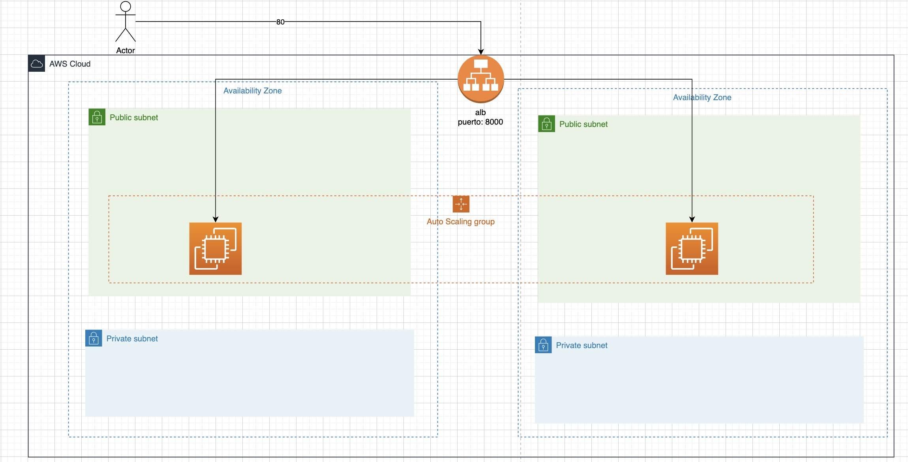

# Desplegando la API de Mythical Mysfits usando Terraform, Auto Scaling Groups y LoadBalancer



Utilizaremos los siguientes recursos para realizar el despliegue de la arquitectura:

- aws_security_group

Security Group ec2
```json
resource "aws_security_group" "sg-backend" {
    name = "http-ec2"
    description = "Allow http and https traffict only"
    vpc_id = data.aws_vpc.default.id

    ingress {
        ## registrar  ingress
    }
    
  egress {
    protocol    = "-1"
    from_port   = 0
    to_port     = 0
    cidr_blocks = ["0.0.0.0/0"]
  }

}
```

Security Group Load Balancer

```json 
resource "aws_security_group" "alb" {
    name = "${var.project_name}-sg-alb_http"
    description = "Allow http and https traffict only"
    vpc_id = data.aws_vpc.default.id

    ingress {
        ## registrar  ingress
    }
    
    
  egress {
    protocol    = "-1"
    from_port   = 0
    to_port     = 0
    cidr_blocks = ["0.0.0.0/0"]
  }

}
```

- aws_launch_configuration
```json
data "template_file" "user_data" {
template = "${file("./scripts/init.sh")}"
}
```

```json
resource "aws_launch_configuration" "main" {
  name_prefix   = "${var.project_name}-lc-main"
  image_id      = ## referenciar ami de ubuntu
  instance_type = "t2.micro"
  user_data = "${data.template_file.user_data.rendered}"
  iam_instance_profile = ## referenciar nombre para conectarse por ssm
  security_groups = ## referenciar security group


  lifecycle {
    create_before_destroy = true
  }
}
```

- aws_autoscaling_group
```json
  resource "aws_autoscaling_group" "backend" {
  name                 = "${var.project_name}-asg-main"
  launch_configuration = aws_launch_configuration.main.name
  min_size             = 1
  max_size             = 4
  vpc_zone_identifier = data.aws_subnet_ids.private.ids
  force_delete              = true
    target_group_arns = [aws_lb_target_group.main.arn] #  A list of aws_alb_target_group ARNs, for use with Application or Network Load Balancing.
  lifecycle {
    create_before_destroy = true
  }
  
  enabled_metrics = [
    "GroupMinSize",
    "GroupMaxSize",
    "GroupDesiredCapacity",
    "GroupInServiceInstances",
    "GroupTotalInstances"
  ]
  metrics_granularity = "1Minute"

 tag {
    key                 = "Name"
    value               = "backend"
    propagate_at_launch = true
  }

  depends_on = [aws_launch_configuration.main]
}
```

- aws_lb
```json
resource "aws_lb" "main" {
  name               = "${var.project_name}-alb"
  internal           = ## especificar el internal
  load_balancer_type = "application"
  security_groups    = ## adicionar Securty Group
  subnets            = ## agregar subnets

  enable_deletion_protection = false

  tags = {
    Environment = "production"
  }
}
```

- aws_lb_target_group

```json
resource "aws_lb_target_group" "main" {
  name        = "${var.project_name}-tg-main"
  port        = ## definir puerto donde se redireccionara el trafico de las peticiones desde el Load Balancer a las instancias.
  protocol    = "HTTP"
  vpc_id      = data.aws_vpc.default.id
}
```

```json
resource "aws_autoscaling_attachment" "asg_attachment_elb" {
  autoscaling_group_name = aws_autoscaling_group.backend.id
  alb_target_group_arn = aws_lb_target_group.main.arn
}
```

- aws_lb_listener

```json
resource "aws_lb_listener" "main" {
  load_balancer_arn = aws_lb.main.arn
  port              = ## definir puerto en el que esuchara el load balancer
  protocol          = "HTTP"

  default_action {
    type             = "forward"
    target_group_arn = ## definir arn del recurso target group
  }
}
```

```bash
terraform plan --auto-approve
```

## Aplicar los cambios con terraform

```bash
terraform apply --auto-approve
```


### Pruebas de balanceo entre las instancias 

```bash
while sleep 1; do curl <<REEMPLAZAR_DNS_LOADBALANCER>>; done
```

## Eliminar los recursos

```bash
terraform destroy --auto-approve
```

## Materiales de apoyo

1. <https://master.d3ne2l9b29wug0.amplifyapp.com/> Desplegando la API de Mythical Mysfits usando Auto Scaling Groups
2. <https://master.d3qozw5mtctwjk.amplifyapp.com/> Desplegando la API usando CloudFormation y Auto Scaling Groups